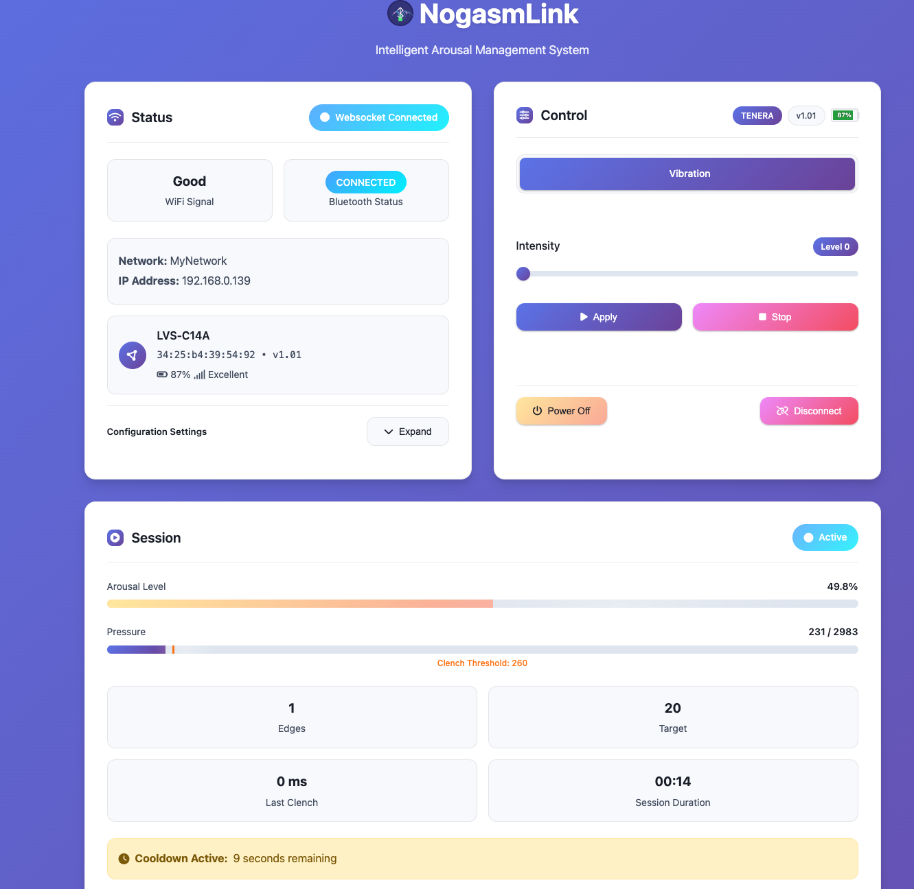

# NogasmLink

An intelligent arousal management system for ESP32 that connects to Lovense devices via Bluetooth LE, using a pressure
sensor for automated edging control and real-time web monitoring.

The inspiration for this project came from the fact that I wanted to build my own `nogasm` but could not source the
motors required for the vibrator easily, which made me think that I already have lots of lovense devices and they all
use Bluetooth LE.

The standard way of connecting to lovense devices is through [their API](https://developer.lovense.com), _however_,
using a direct BLE connection does not need to send data back and forth to their servers and the device control is
**local** only, which is better for privacy and response times. The ESP here essentially acts as the lovense remote app.

This reduces the friction of building the project in my opinion. I'm not that great with PCB design (software is my main
thing) and my current version is hand soldered. It would be great if the community can help design a solid PCB for this
project specifically

## Features

- **Pressure Sensor Integration**: Real-time monitoring with configurable sensitivity
- **Bluetooth LE Device Control**: Native support for Lovense devices (Nora, Max, Lush, etc.)
- **Intelligent Edging**: Automated arousal detection with cooldown periods
- **Clench Detection**: Advanced pressure pattern recognition
- **Web Interface**: Real-time dashboard with data visualization and device control
- **Hardware Controls**: Rotary encoder for sensitivity adjustment and emergency stop

## Lovense

The device will automatically reconnect on ble failure, and supports connecting to the last device on startup, which
allows the UI to be used minimally supporting hands-free use.

Tested and working with:

* Tenera
* Max
* Solace
* Hush _(a bit pointless for this project 🤣)_

## UI

### Scanner


### Session



### Analytics


### Config

#### General


#### Clench


## Credits

- https://github.com/nogasm/nogasm
- https://github.com/MausTec/edge-o-matic-3000
- https://github.com/Edging-Machines/Edging-Machines
- https://docs.buttplug.io/docs/stpihkal/protocols/lovense/

## Hardware


### Components

- ESP32 development board
- MPX5700GP pressure sensor
- Rotary encoder with push button
- RGB LED (common cathode)
- Appropriate resistors and breadboard/PCB

### Pin Configuration

```
Pressure Sensor: GPIO 34
Encoder A/B:     GPIO 32/33  
Encoder Button:  GPIO 35
RGB LED:         GPIO 25/26/27
```

## Installation

### 1. Build Web Assets

```bash
cd webapp
yarn install
yarn build
```

### 2. Upload Firmware

```bash
# Install PlatformIO dependencies
pio lib install

# Build and upload firmware
pio run --target upload

# Upload filesystem image (includes web assets)
pio run --target uploadfs
```

### 3. Initial Setup

1. Device creates "NogasmLink" WiFi AP on first boot
2. Connect and configure WiFi credentials
3. Access web interface at device IP
4. Pair Lovense device

#### Startup

```text
[INFO]  Starting up NogasmLink...
[INFO]  Initializing BLE...
[INFO]  Nogasm BLE Manager initialized with name: NogasmLink
[INFO]  WiFi Connected! IP Address: 192.168.0.139
[INFO]  mDNS responder started, Device can be reached at: NogasmLink.local
[INFO]  WebSocket server initialized on path: /ws
[INFO]  HTTP server started @ 8080
[INFO]  EncoderManager::init -> value:63
[INFO]  IDLE -> SCANNING :: Start scanning
[INFO]  SCANNING -> IDLE :: Scan completed
[INFO]  IDLE -> CONNECTING :: Connecting to device...
[INFO]  CONNECTING -> FINDING_SERVICE :: connect() success
[INFO]  FINDING_SERVICE -> CONNECTED :: Connected successfully!
```

## Usage

1. **Device Pairing**: Scan and connect via web interface
2. **Session Control**: Start/stop arousal management from dashboard
3. **Sensitivity**: Adjust via rotary encoder or web interface
4. **Emergency Stop**: Press encoder button anytime
5. **Data Export**: Download session data as CSV

## API Overview

### Key Endpoints

```
GET/POST /api/arousal/status     # Session control
GET/POST /api/arousal/config     # Configuration
POST     /api/vibrate            # Device control
GET      /api/devices            # BLE scanner
```

### WebSocket Updates

Real-time data at `/ws`:

- `ble_status`: Device connection state
- `arousal_status`: Pressure, arousal level, session state

## Configuration Options

- **Arousal Decay Rate**: How quickly arousal decreases (0.1-0.99)
- **Sensitivity Threshold**: Peak detection sensitivity
- **Ramp/Cooldown Times**: Speed control and rest periods
- **Clench Detection**: Pressure pattern recognition settings

## Architecture

**Core Components**: ArousalManager, NogasmBLEManager, PressureSensor, EncoderManager, RGBManager, NogasmHttp

**Data Flow**: Pressure sensor → Arousal detection → State machine → Device control → User feedback